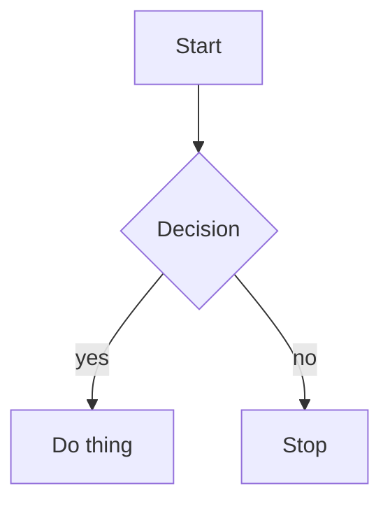

<div align="center">
  
</div>

<br />

<div align="center">


</div>

> ⚠️ **Not actively maintained.** This project is feature-complete for flowcharts but no longer under active development. It works — and it's MIT-licensed, so forks and PRs are very welcome. Clone it, build it, make it yours.

## What is Mermvis?

Mermvis is a VS Code extension that lets you build and edit [Mermaid.js](https://mermaid.js.org) diagrams visually — no syntax writing required. It registers a custom editor for `.mmd` files, so opening one drops you straight into a three-pane workspace: drag nodes, connect edges, configure layouts, and the `.mmd` text stays in perfect sync.

In the age of AI-assisted development, having a **clear, crystalized visual blueprint** of your system is valuable. LLMs work best with structured, precise context — not vague descriptions. Mermvis bridges human visual thinking and machine-readable system models.

> Draw your system. Export the blueprint. Feed it to your AI.

<div align="center">
  
  <br />
  <sub>Canvas, Code, and live Preview — all in one VS Code editor, kept in sync.</sub>
</div>

## How It Works

Open any `.mmd` file in VS Code and Mermvis takes over as the editor. Three synchronized views work on the same diagram:

- Edit a node on the **Canvas** → the Mermaid source in **Code** updates instantly.
- Type Mermaid syntax in **Code** → the **Canvas** and **Preview** re-render.
- The file on disk stays a plain `.mmd` — fully portable, git-friendly, and readable by any other Mermaid tool.

Node positions and styling that don't belong in Mermaid syntax are persisted in a small sidecar file, so your layout survives reopens without polluting the diagram source.

## Features

### Three Views, One Editor

| View | Description |
|------|-------------|
| **Code** | Full syntax editor with Mermaid highlighting (CodeMirror 6) |
| **Preview** | Live rendered diagram with theme and curve controls |
| **Canvas** | Infinite drag-and-drop canvas — Miro-style visual editing |

### Canvas Editing
- Drag nodes from the sidebar onto the canvas
- Connect nodes via directional handles (top / bottom / left / right)
- 14 node shapes — Rectangle, Rounded, Diamond, Stadium, Circle, Hexagon, Cylinder, and more
- Inline label editing — double-click any node or edge
- Undo / Redo with full history stack

### Diagram Controls
- Layout direction — Top-to-Bottom, Left-to-Right, Bottom-to-Top, Right-to-Left
- Mermaid themes — default, dark, forest, neutral, base
- Hand-drawn (sketch) mode toggle
- 12 curve routing styles
- Auto-layout powered by Dagre

### Import & Export
- Edit `.mmd` Mermaid files directly — no import step
- Export `.svg` and canvas `.json`
- Copy Mermaid syntax to clipboard in one click

### VS Code Integration
- Respects your VS Code dark / light theme automatically
- Auto-save with debounce (toggle via the `mermvis.autoSave` setting)
- Command palette actions and configurable keybindings
- Inspector panel — click any node to edit its properties
- External file-change detection — edits made outside the editor are picked up

## Roadmap

These were planned but not built. Up for grabs if you fork:

- [ ] Subgraph support
- [ ] Sequence / class / ER / state diagram support
- [ ] Mindmap support
- [ ] Split-insert — drag a node onto a connection to insert it between
- [ ] Custom theme editor
- [ ] AI-assisted diagram generation

## Tech Stack

| Layer | Choice |
|-------|--------|
| Host | VS Code Custom Editor API (`.mmd` files) |
| Webview UI | React 19 |
| Visual Canvas | React Flow ([XY Flow](https://reactflow.dev)) |
| Code Editor | CodeMirror 6 |
| Mermaid Render | mermaid.js 11 |
| State | Zustand |
| Layout | Dagre |
| Language | TypeScript 5 |
| Build | esbuild (extension host) + Vite (webview) |

## Development

```bash
git clone https://github.com/SauliusDev/mermvis.git
cd mermvis
npm install
```

Then press **F5** in VS Code (Run → Start Debugging → *Run Extension (Dev / HMR)*). This launches an **Extension Development Host** window with Mermvis loaded and hot-reload running. Open any `.mmd` file in that window to start editing.

No `.mmd` file handy? Create one:



### Scripts

```bash
npm run dev               # esbuild watch + Vite dev server (auto-run by F5)
npm run build             # production build
npm run lint              # ESLint
npm run test:webview      # React/Vitest unit tests (components, store, parsers)
npm run test:unit         # extension-host unit tests (jest-mock-vscode)
npm run test:integration  # full VS Code integration tests (slow)
```

**Requirements:** Node.js 18+ and VS Code 1.80+.

## Contributing

PRs and forks welcome — the project is MIT-licensed and unmaintained, so don't wait on me. Open an issue for discussion if you like, but you're equally free to just fork and ship.

The codebase follows strict TypeScript with 2-space indentation and single quotes. Webview React code lives in `src/webview/`, extension-host code in `src/extension/`. Tests are co-located next to source files.

## License

Mermvis is licensed under the **[MIT License](LICENSE)** — use it, fork it, embed it, sell it. No restrictions beyond keeping the copyright notice.

## 🙏 Attribution

Mermvis is built on the shoulders of two open-source projects:

- **[mermaid-visual-editor](https://github.com/saketkattu/mermaid-visual-editor)** by [@saketkattu](https://github.com/saketkattu) — the original visual drag-and-drop Mermaid editor that Mermvis was forked from
- **[mermaid-reactflow-editor](https://github.com/albingcj/mermaid-reactflow-editor)** by [@albingcj](https://github.com/albingcj) — inspiration and code for the React Flow canvas and Mermaid-to-canvas conversion approach

<div align="center">
  <sub>⭐ If this project helps you, please give it a <a href="https://github.com/SauliusDev/mermvis">Star!</a></sub>
</div>
